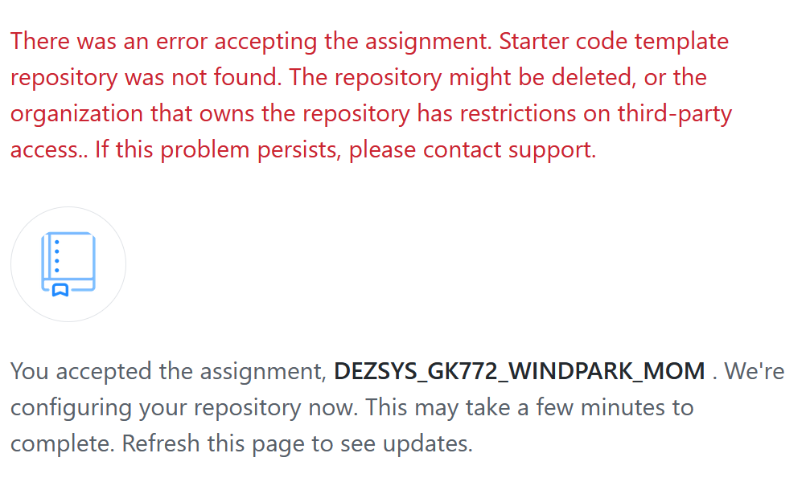
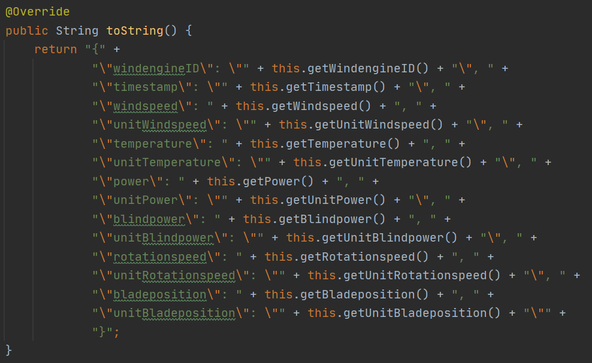
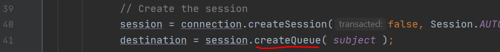
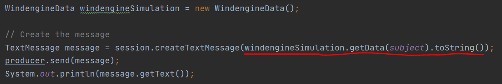
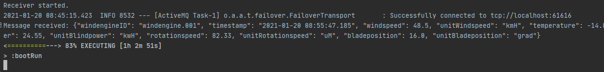
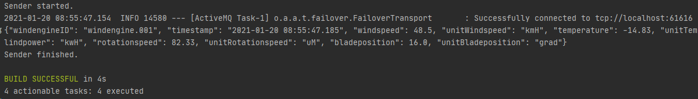
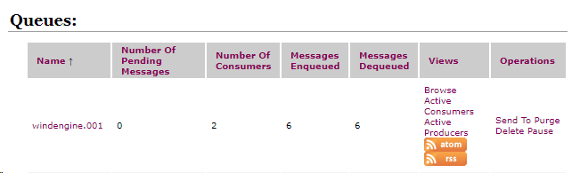

# DEZSYS_GK772_WINDPARK_MOM

#### Author: aoeztuerk

#### Date: 19.01.2021

## ActiveMQ

Bevor wir mit der Aufgabenstellung beginnen, müssen wir den ActiveMQ (wo die Nachrichten gequeued werden) herunterladen und den Dienst ausführen.

Hierfür geht man auf folgenden Link:

[activemq.apache.org/components/classic/download/](activemq.apache.org/components/classic/download/)

Dort ladet man sich die entsprechende Datei herunter, öffnet ein Terminal, geht in den /bin Folder des ActiveMq und führt den Dienst mit `activemq start` aus. 

Danach kann man den localhost:8161/admin ausführen und sich mit User:admin und Pw: admin einloggen

Stoppen kann man den Dienst mit dem Befehl `activemq stop`

## Aufgabenumsetzung

Noch bevor ich anfangen konnte, wurde mir der Zugriff auf das GitHub Classroom Repo verweigert.



Daher habe ich Klassenkollegen gefragt, ob sie mir die Dateien im ursprünglichen Repo senden könnten. Da war der Herr Proschek so lieb und hat mir seins geschickt, weil er auch in dem ursprünglichem Repo nichts gepusht hat. Er hat eigene Repositories verwendet, was ich auch machen werde.

### Link zu meinem Repo

https://github.com/aoeztuerk-tgm/DezSys-MOM-S07

### WindeingineData

Zuerst habe ich die WindengineData-Datei von der vorherigen Laborübung genommen und es hier verwendet, damit Windrad-Daten erzeugt werden können. Dabei habe ich auch gleich die Methoden, die in der WindengineSimulation-Datei waren hier implementiert. Zum Schluss habe ich die toString()-Methode überarbeitet und diese so aufgebaut, dass bei einem Aufruf, die Ausgabe im JSON Format erfolgt.




### MOMSender

Die vorherigen Schritte waren relevant, weil man beim Senden generierte und möglichst nicht-idente Daten will und damit diese auch im JSON Format ausgegeben werden. Wenn man sie aber schon im JSON Format sendet erspart man sich die Arbeit nachher.

Beim MOMSender ändert man beim Erstellen der Session bei der destination die Methode createTopic() zu createQueue() um, weil ja eine MessageQueue angefordert wird.



Danach fügt man beim Erstellen des Produzenten die WindengineData hinzu. Diese wird beim Erstellen der Nachricht verwendet, um die Daten zu generieren und diese im JSON-Format als String zu senden und auch auszugeben.



### MOMReceiver

HIer beginnen wir auch genau wie beim MOMSender und tauschen die createTopic() Methode mit einer createQueue() aus. Das wars dann auch schon.

Jetzt öffnet man zwei Terminals und in einem gibt man folgendes ein, um den receiver zu runnen:

````bash
gradle clean bootRun -Pargs=receiver
````



Im anderen gibt man folgendes ein, um den Sender zu runnen:

````bash
gradle clean bootRun -Pargs=sender
````



Außerdem sieht man auch in der im ActiveMQ, wenn man den *localhost:8161/admin* in einem Browser aufruft und in die Queues-Table reinschaut, dass da Nachrichten in einer Queue sind.



### Problemstellungen

Ursprünglich habe ich die Aufgabe auf meinem Desktop versucht zu lösen. Obwohl ich alles richtig programmiert, importiert und due Dependencies richtig gesetzt hatte, hat es einfach nicht funktioniert. Also habe ich meinProjekt auf ein Repositiy hochgeladen und es versucht von meinem Notebook auszuführen, und da läuft es einwandfrei. 

Mein Major-Problem war, dass es auf meinem Dektop den folgenden Error ausgegeben hat, worauf ich nach 2 Stunden googlen immer noch keine Antwort gefunden habe:

- What went wrong:
   Execution failed for task ‘:bootRun’.

> A problem occurred starting process ‘command ‘C:\Program Files\Java\jdk1.8.0_181\bin\java.exe’

