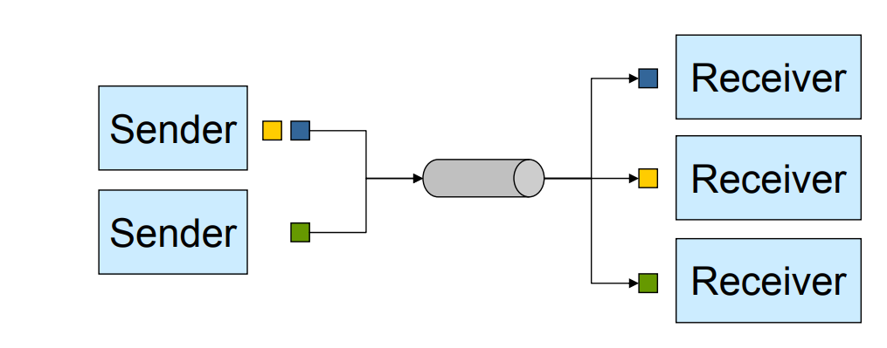
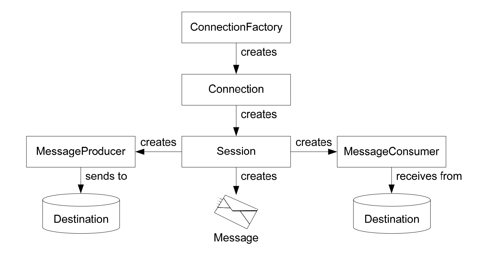
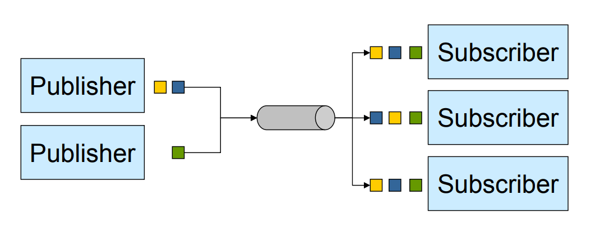
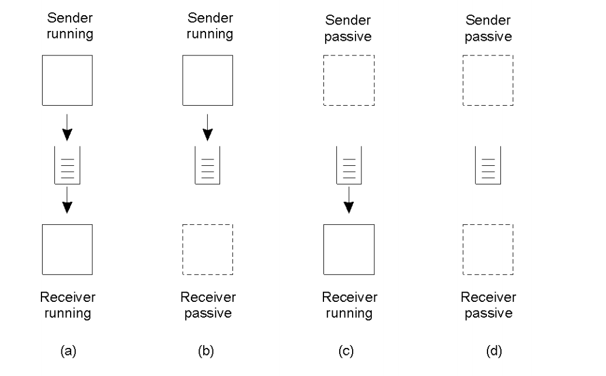

# Research

#### Author: aoeztuerk

#### Date: 20.01.2021

## Fragestellungen

- Nennen Sie mindestens 4 Eigenschaften der Message Oriented Middleware?

  - Message Queuing
  - Persistent (asynchronous) communication
  - Intermediate storage capacity for messages in the communication network
  - Communication may take minutes (not ms)
  - Basic idea: insert message into queue

- Was versteht man unter einer transienten und synchronen Kommunikation?

  - Transient communication: Message is stored only as long as sender and receiver are executing
  - Synchronous: Sender is blocked until:
    - Buffered at receiving host
    - Delivered to receiver
    - Receiver has processed the message

- Beschreiben Sie die Funktionsweise einer JMS Queue?

  - 
  - M senders, N receivers
  - One message only delivered to a single receiver (point-to-point)
  - Increases scalability
    - Can be used for load balancing between the receievrs

- JMS Overview - Beschreiben Sie die wichtigsten JMS Klassen und deren Zusammenhang?

  - 
  - Die Connection Factory erstellt eine Verbindung, welche eine Session erstellt, welche einen Sender und Receiver erstellt. Die Sender und Receiver senden und empfangen zu und von einer Destination Nachrichten. Die Nachrichten werden hierbei auch von der Session Klasse erstellt.

- Beschreiben Sie die Funktionsweise eines JMS Topic?

  - 
  - M publisher, N subscriber
  - One message delivered to all subscribers
  - No guarantee on message ordering

- Was versteht man unter einem lose gekoppelten verteilten System? Nennen Sie ein Beispiel dazu. Warum spricht man hier von lose?

  - *Loose coupling describes a coupling technique in which two or more hardware and software components are attached or linked together to provide two services that are not dependent on one another. This term is used to describe the degree and intent of interconnected but non-dependent components within an information system.*

    *Loose coupling is also known as low or weak coupling.*

    Eine ungefähre Übersetzung ist, dass lose gekoppelte Systeme jeweils Komponenten aufweisen, die keine Abhängigkeit voneinander haben.

    **Beispiel: **Mal angenommen, ein Unternehmen möchte seine Hardware austauschen (aus welchem Grund auch immer). Dann soll das verteilte System keine Abhängigkeit von der ausgetauschten Hardware haben, damit der Prozess fehlerfrei verlaufen kann.

  - Hier wird von lose gesprochen, weil der Sender und der Receiver voneinander unabhängig arbeiten. Es gib vier Kombinationen für Lose gekoppelte Systeme, die Queues verwenden:

  - 

## Quelle

Grundlagen Message Oriented Middleware: [Presentation](https://elearning.tgm.ac.at/pluginfile.php/225789/mod_resource/content/1/dezsys_mom_einfuehrung.pdf)